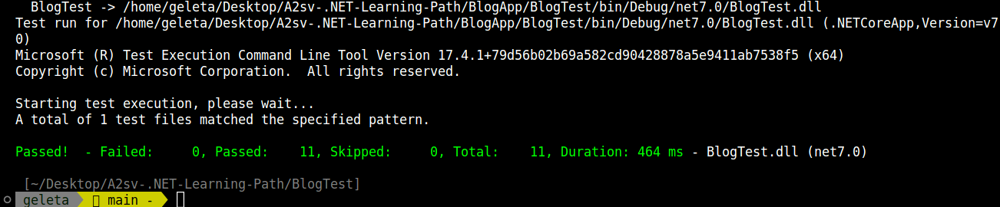

## BLOG API TEST

### UNIT TEST  DOCUMENTATION

#### TECH STACKS USED
 - C#
- .NET
- XUNIT
- InMemory Database

#### POST REPO TEST
- This part of the test covers all the parts relating to the CRUD repository of the Post. 

#### COMMENT REPO TEST
- This part of the test covers all the parts relating to the CRUP repositroy of the Comment.

